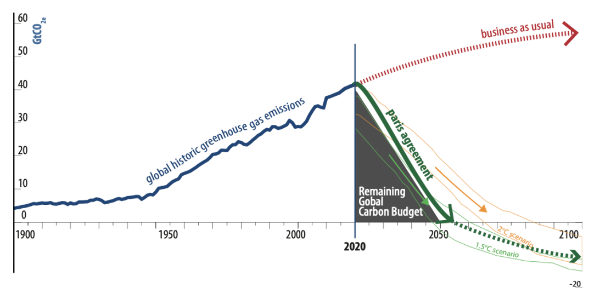

# About

### Problem

The Paris Agreement of 2016 mandated that global impact due to CO2 emissions be kept below 1.5 degrees C to avoid irrecoverable damage to the Earth. Inline with this, by 2050, the world needs to achieve a net zero carbon emission state. The transition to renewable energy is accelerating but the problem is that its still not on pace to meet this global target.

Solar energy is now affordable and increasingly being accepted as a viable alternative to current energy systems. A radical roll-out of solar energy can only occur due to a huge aggregation of small and medium sized projects. The large capital flows needed for this transition needs to be able to reach small and medium scale projects directly and efficiently.

There exist multiple options for financing solar energy in the USA. However, the underlying contractual frameworks are not fit for the purpose of a radical mobilization of capital. Most long-term power purchase agreements \(PPA\), lease-to-own models and procedures to capture the associated investment tax benefits and green attribute credits are cumbersome and require sufficient economies of scale to be affordable.

Furthermore, the industry lacks a common platform and standard to seamlessly integrate a full array of investors— overseas, institutional, public and private— with beneficiaries. Current platforms also only offer a limited range of investment types.

To the energy finance world, "there is more money available than there are projects." This is in part due to the cumbersome legal pipeline that developers must navigate from project inception to capitalization. The result leave the needed decentralized community projects will little access to capital.

These are the problem Opensolar aims to solve, by providing a platform for community owned solar projects that leverages distributed ledger technology and IoT driven smart contracts for contractual automation in financial processes.

