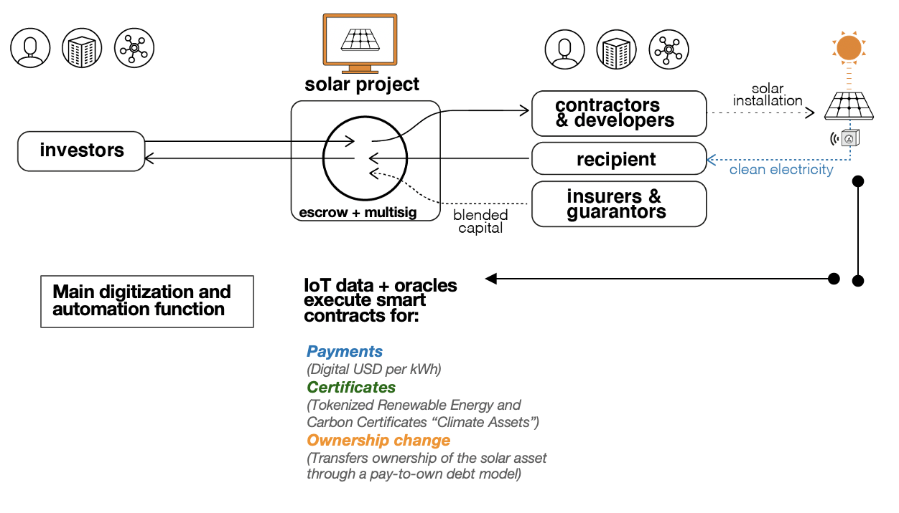

# Why blockchain

The blockchain through its architecture provides something that no solution has before - a borderless, publicly verifiable and auditable ledger. For project finance, all three are advantages:

1. **Borderless system:** A borderless sytem removes boundaries associated with entities on the system. An investor in the US can invest in an Rwandan project and an Asian investor can invest in an Australian project.
2. **Publicly verifiable:** One of the problems in green energy projects is their inability to verify and account for different parts of the system. By cleverly using the blockchain as a commitment layer, this can be mitigated.
3. **Auditable:** Since anyone can audit the ledger, malicious entities can be easily thwarted due to the availability of a public flow of information.

By applying a combination of IoT, blockchain and financial technology along with an intuitive user interface, Opensolar aims to significantly remove the financial frictions preventing a full decarbonization of the energy sector.

