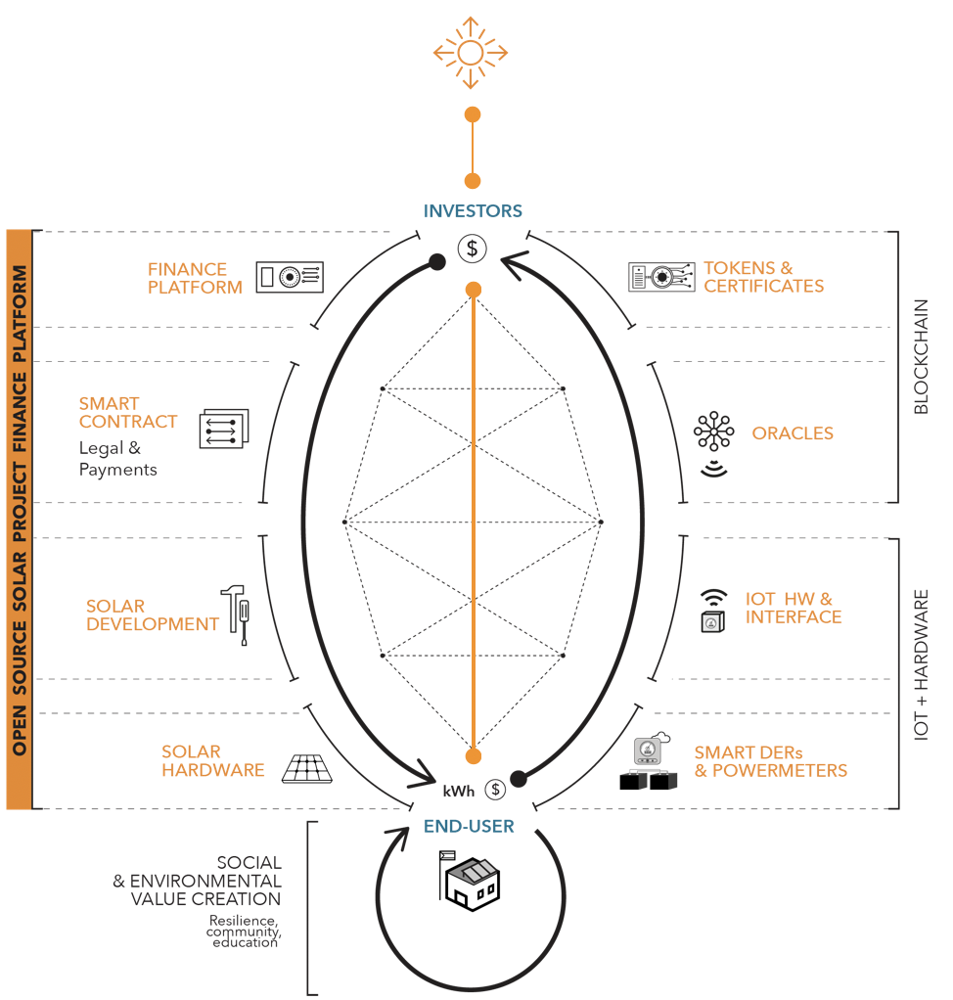
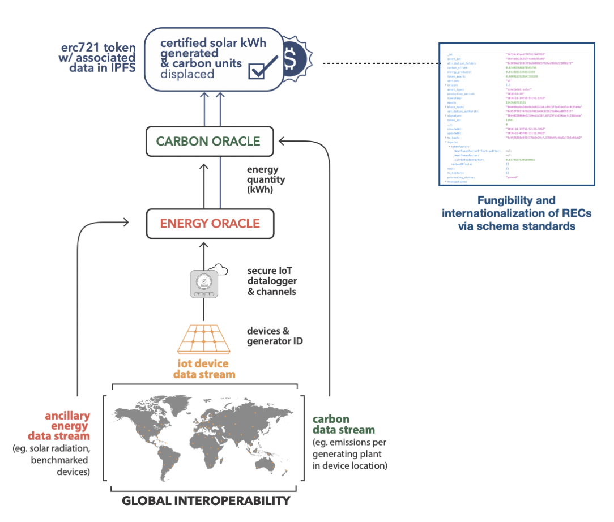

# Introduction

Opensolar is an open source platform built using the Stellar blockchain that enables investments in solar infrastructure. Opensolar is built on openx, a broader "platform of platforms" architecture for investments in blockchains. Opensolar aims to automate the process of energy production, billing, and asset ownership for the recipient and the process of continual returns for the investor.

Opensolar is designed to be modular and each module can be used in a different application. 

Investors and Receivers on the platform need to perform KYC to be able to invest and partake in projects listed on Opensolar. Developers and Contractors need to store details related to their company on the platform to get approval from investors and receivers. Guarantors need to store their details and provide sufficient proof of funding. If entities need to handle Stablecoin \(AnchorUSD\) on the platform, they must perform KYC on anchorusd.com.

The platform maintains an internal database built on boltDB to keep track of entity details, project details and other details that are exclusive to it.

The platform uses IoT devices for monitoring energy production and stores the data generated by these devices on IPFS. A piece of software called the teller reads data from the IoT device and triggers payment conditions on the platform.

The platform's investment and payment workflow is regulated by a smart contract run on AWS. This smart contract interfaces with the blockchain, coordinates payments between the receiver and investors, and more.

The solar infrastructure of Opensolar is composed of multiple parts:

1. Solar Panels
2. IoT devices which report energy generated to the IoT Hub, and
3. An IoT Hub which records the amount of energy generated during an interval of time

Opensolar interfaces with the IoT Hub to collect data on energy consumption and the IoT Hub triggers conditions defined by the smart contract. This is done by running a piece of software called the Teller on the IoT Hub.

