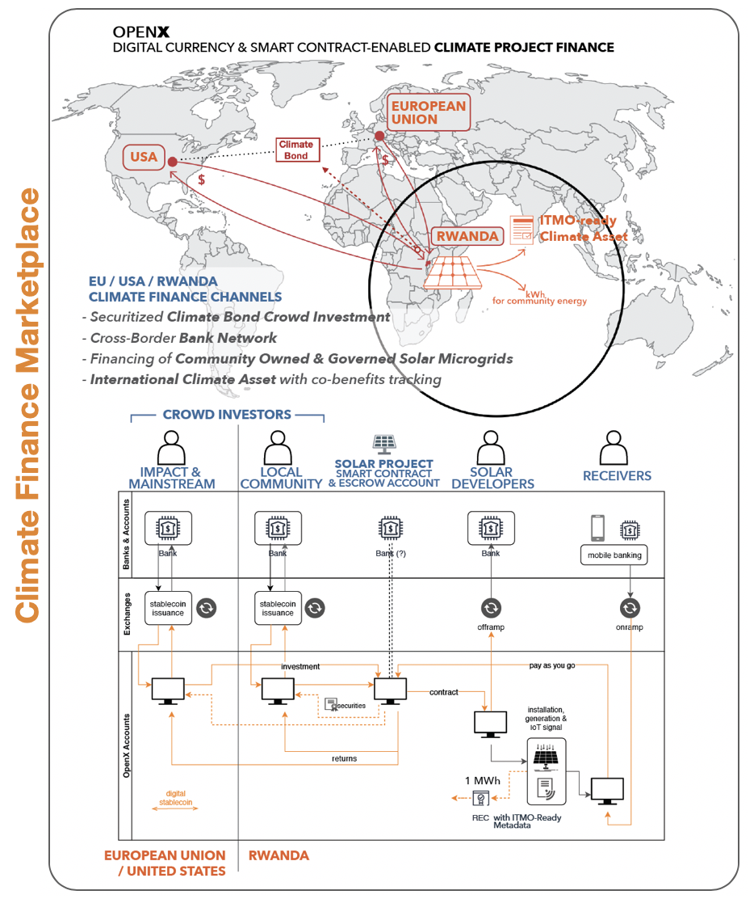

# Introduction

### Introduction

Openx is a "platform of platforms" architecture for investments using blockchains. Openx is built on the Stellar blockchain but its modular architecture enables it to be used in combination with any blockchain. Openx provides a set of functions for platforms composed of the following parts:

1. A **User Entity** handling cryptocurrency operations
2. A **JSON-RPC interface** through which the frontend and other pieces of software can interact with the backend.
3. **Auxiliary packages** that handle functions like AML screening and stablecoin support.

The functionality associated with each package is exposed through a JSON-RPC API. This API follows a token based authentication scheme which callers can invoke. Openx also provides auxiliary features through its API that platforms might find useful like AML screening powered by ComplyAdvantage.

Openx platform skeletons can be created using the CLI based tool create-openx-app, and a live platform can be forked from Opensolar. A CLI interface can be downloaded from the emulator repository. The web interface can be cloned from the openx-frontend repository.

There is one entity on openx that acts as a parent entity for entities on openx based platforms - the "User" entity. This entity contains fields that are needed to maintain cross-compatibility with other openx based platforms. It also contains handlers for all cryptocurrencies supported by openx, and platforms are highly recommended to import this functionality from openx.

As a rule, cryptocurrency operations and handling must take place within the parent openx platform. If platforms would like to add support for other cryptocurrencies, such functionality must be added to the openx repository to enable cross platform investments with the new cryptocurrency. This is to ensure that users in openx based platforms do not worry about security of the platform, and can refer to openx's central contract audits to build confidence in the platform. This is also to encourage the idea of open innovation where people can collaborate on building something useful.

Openx provides a rescue tool to use in the event the platform is down, or someone is trying to hack the platform. This rescue tool can be used to quickly sweep funds belonging to the platform to another address. This tool also enables assets like USD if the caller can specify the asset's name to the tool.

Openx uses boltDB, a key value pair database to store user credentials, encrypted user seed, and more. It uses IPFS to store bigger ceredentials that platforms might need.

Openx also provides a CI-enabled build server that can be used to release platform builds for different platforms. This is used by openx to provide pacakges for its own releases at builds.openx.solar.

Openx also has a PPA to enable easy installation for linux users. This is easily configurable by other platforms as well.

Opensolar is an instance of openx targeted towards solar energy projects. Other platform applications include:

* **Decentralised community infrastructure**
  * Water
  * Housing
  * Transport
  * Power
  * Waste
* **Climate Finance**
  * Forest-based project
  * Regenerative agriculture
  * Energy efficiency programs 
  * Adaptation infrastructure 
  * Biogas

